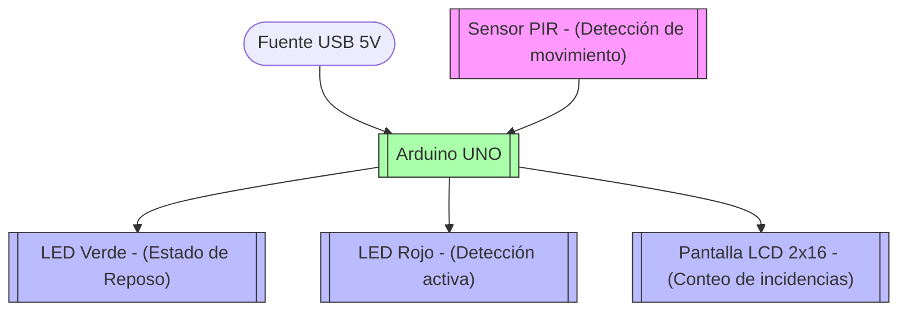

# IoT

```mermaid
graph TD
    FUENTE([Fuente USB 5V])
    ARDUINO[[Arduino UNO]]
    PIR[["Sensor PIR - (Detección de movimiento)"]]
    LED_VERDE[["LED Verde - (Estado de Reposo)"]]
    LED_ROJO[["LED Rojo - (Detección activa)"]]
    LCD[["Pantalla LCD 2x16 - (Conteo de incidencias)"]]

    FUENTE --> ARDUINO
    PIR --> ARDUINO
    ARDUINO --> LED_VERDE
    ARDUINO --> LED_ROJO
    ARDUINO --> LCD

    classDef sensor fill:#f9f,stroke:#333,stroke-width:1px;
    classDef actuator fill:#bbf,stroke:#333,stroke-width:1px;
    classDef logic fill:#afa,stroke:#333,stroke-width:1px;

    class PIR sensor;
    class LED_VERDE,LED_ROJO,LCD actuator;
    class ARDUINO logic;
```